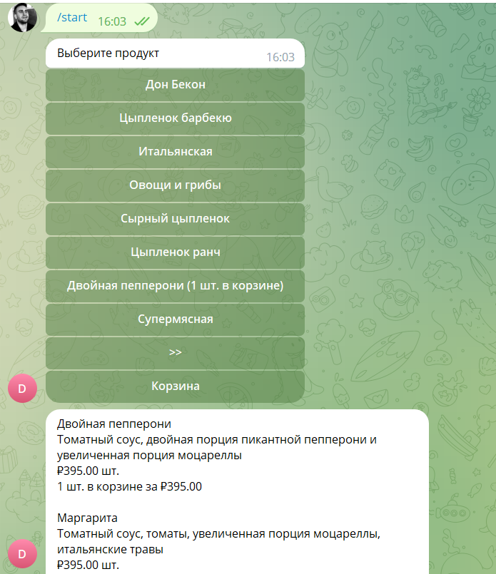
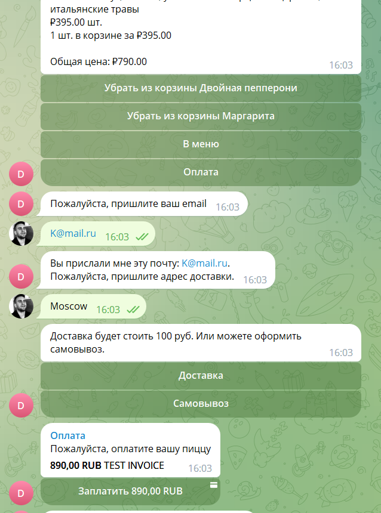

# Pizza Bot

### Overview

MVP of telegram shop with:

- menu
- product descriptions
- cart
- payment
- geo
- notifications (deliveryman and client)




MVP of facebook shop with:

- menu
- product descriptions
- cart

### How to install

#### Start

Python3 should be already installed.
Then use `pip` (or `pip3`, if there is a conflict with Python2) to install dependencies:

```
pip install -r requirements.txt
```

#### Telegram

You need to create `.env` file and write next parameters in file:

`TG_BOT_TOKEN` - secret telegram bot token. Use [this](https://core.telegram.org/bots#creating-a-new-bot) instruction (
use VPN to open this link in Russia).

After you got `TG_BOT_TOKEN` you need to write to you telegram bot any message (`/start` for example).

`MOTLIN_CLIENT_ID` - ID of your shop in [elasticpath](https://euwest.cm.elasticpath.com/application-keys#legacy-key)

`MOTLIN_CLIENT_SECRET` - Secret token of your shop
in [elasticpath](https://euwest.cm.elasticpath.com/application-keys#legacy-key)

`REDIS_DB_ADDRESS` - register your [redis](https://redislabs.com/) account and get address of your database (for
example `redis-13965.f18.us-east-4-9.wc1.cloud.redislabs.com`).

`REDIS_DB_PORT` - usually port writes in db address in the
end `redis-13965.f18.us-east-4-9.wc1.cloud.redislabs.com:16635`

`REDIS_DB_PASSWORD` - redis also will generate your DB password when your will init DB.

`YANDEX_GEO_APIKEY` - [service](https://yandex.ru/dev/maps/geocoder/) API key for getting coordinates by address (
customer and pizzeria).

`BANK_TOKEN` - token for integration with payments via telegram. You can get it from @BotFather

`TEST_TELEGRAM_CHAT_ID` - Optional. Id of the chat where delivery messages can be sent.
You can leave it blank, but in this case you must add this to the pizzeria data when uploading (may be different for
each pizzeria).

`CUSTOMER_ADDRESSES_FLOW_SLUG` and `PIZZERIA_ADDRESSES_FLOW_SLUG` - Optional. Slugs of moltin models.
You can leave it blank if you chose the default, but you must also change it in `customer_address_flow.json`
and `pizzeria_address_flow.json`.
You will need to change `address_flow -> data -> slug` for both files.

`PIZZERIA_ADDRESSES_DELIVERYMAN_TELEGRAM_CHAT_ID`, `PIZZERIA_ADDRESSES_ADDRESS`, `CUSTOMER_ADDRESSES_CUSTOMER_ID_SLUG`
, `CUSTOMER_ADDRESSES_LONGITUDE_SLUG`, `CUSTOMER_ADDRESSES_LATITUDE_SLUG` - Optional. Slugs for model fields.
You can leave it blank, but if you want to fill it in manually, you must also change these slugs in
the `customer_address_flow.json` and `pizzeria_address_flow.json` files.
This data is stored in `address_fields -> slug` for each field.

`PRODUCTS_ON_PAGE` - Optional. By default, maximum 8 products (pizza) per page in telegram.

`PROXY` - proxy IP with port and https if you need. Work with empty proxy if you in Europe.

Then optional run script `load_init_data.py` to load some init data and create models in moltin:

```
python load_init_data.py
```

#### Facebook
Create shop page on facebook
Create app on facebook developer
Add to your ap webhook and facebook messenger products

Left or add settings from telegram.
You need this keys from telegram part env:
`MOTLIN_CLIENT_ID`, `MOTLIN_CLIENT_SECRET`, `REDIS_DB_ADDRESS`, `REDIS_DB_PORT`, `REDIS_DB_PASSWORD`

`FB_VERIFY_TOKEN` - token of your webhook app in facebook
`FB_PAGE_ACCESS_TOKEN` - token of your bot page in facebook
`PIZZA_LOGO_URL` - url with your shop image
`MAIN_CATEGORY_ID` - main pizza category id in motlin (because you can't shaw all, only 10)
`CART_IMAGE_URL` - url with your cart image

Get domain with https and run bot on this domain
```
python fb_bot.py
```
In facebook developer link your domain with webhook
Add subscription on messages for your page

### How to use

Open command line (in windows `Win+R` and write `cmd` and `Ok`). Go to directory with program or write in cmd:

```
python tg_bot.py 
```

### References

- [telegram bots documentation](https://core.telegram.org/bots#creating-a-new-bot)
- [redis](https://redislabs.com/)
- [elasticpath](https://www.elasticpath.com/)
- [yandex geocoder](https://yandex.ru/dev/maps/geocoder/)

### Project Goals

The code is written for educational purposes on online-course for web-developers [dvmn.org](https://dvmn.org/).
